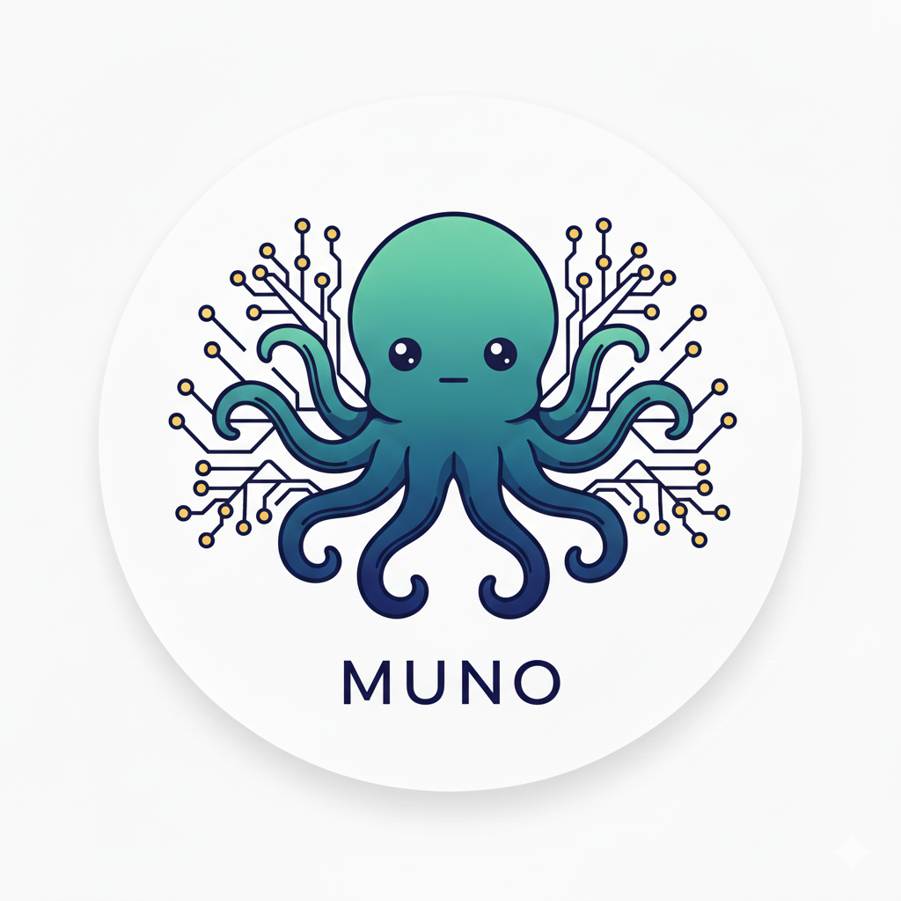

  
# MUNO

Transform your multi-repository development into a unified tree-based workspace with AI-powered navigation.
  
[English](#) | [한국어](README_ko.md)

## The Name: MUNO 🐙

**MUNO** originated from the need to manage Musinsa's growing number of repositories with the simplicity of a monorepo.

### 🎯 Primary Meanings

1. **MUsinsa moNOrepo**
   - Born from the challenge of managing Musinsa's multi-repository architecture
   - Brings monorepo-like convenience to multi-repo projects
   - Unified operations while maintaining repository independence

2. **MUsinsa UNO**
   - "UNO" (one) - One tool to unify all repositories
   - Single command interface for complex multi-repo operations
   - One workspace, infinite possibilities

3. **Multi-repository UNified Orchestration**
   - The technical definition: orchestrating multiple repositories as a unified workspace
   - Professional, descriptive acronym for broader adoption

### 🔊 Pronunciation
- **English**: "MOO-no" (like "mono" with a 'u')
- **Korean**: Similar to "문어" (mun-eo), which coincidentally means "octopus"
- Easy to pronounce in most languages

### 🐙 The Octopus Symbol
The octopus perfectly represents MUNO's capabilities:
- **Multiple Arms**: Each repository is like an arm, working independently yet coordinated
- **Intelligence**: Smart navigation and lazy-loading
- **Adaptability**: Flexible structure that adapts to any project size
- **Central Control**: One brain (MUNO) orchestrating all arms (repositories)

## Overview

MUNO introduces a revolutionary **tree-based architecture** that treats your entire codebase as a navigable filesystem, eliminating complexity while providing intuitive, CWD-first operations.

### Inspired by Google Repo, Built for Modern Needs

MUNO was inspired by [Google's Repo tool](https://gerrit.googlesource.com/git-repo) but born from the need to overcome its limitations:

- **Tree Structure**: While Repo manages flat repository collections, MUNO enables true hierarchical organization with parent-child relationships
- **Parent Documentation**: Repo lacks the ability to document and manage parent nodes - MUNO treats every node as a first-class citizen
- **Intuitive Navigation**: Navigate your repository tree like a filesystem with `muno use`, unlike Repo's manifest-centric approach
- **Flexible Organization**: Build custom tree structures that match your team's mental model, not forced into flat layouts

## Key Innovation: Tree-Based Navigation

### 🌳 **Workspace as a Tree**
Your repositories form a natural tree structure:
```
repos/
├── team-backend/           # Also a git repo
│   ├── payment-service/    # Child repo
│   ├── order-service/      # Child repo
│   └── shared-libs/        # Lazy-loaded repo
└── team-frontend/          # Also a git repo
    ├── web-app/            # Child repo
    └── component-lib/      # Lazy-loaded repo
```

### 📍 **CWD-First Resolution**
Commands operate based on your current location:
```bash
cd repos/team-backend
muno pull                    # Pulls backend repos (CWD-based)
muno add https://...         # Adds repo to backend team
muno tree                    # Shows tree from current position
```

### 💤 **Smart Lazy Loading**
Repositories clone on-demand:
```bash
muno use team-backend        # Auto-clones lazy repos
muno use --no-clone frontend # Navigate without cloning
muno clone --recursive       # Manual clone when needed
```

## Core Features

- 🌳 **Tree Navigation**: Navigate your workspace like a filesystem
- 📍 **CWD-First**: Current directory determines operation target
- 🎯 **Clear Targeting**: Every command shows what it affects
- 💤 **Lazy Loading**: Repos clone only when needed
- 🚀 **Single Binary**: No runtime dependencies
- ⚡ **Fast**: Written in Go for optimal performance

## Installation

### From Source

```bash
git clone https://github.com/taokim/muno.git
cd muno
make build
sudo make install
```

## Quick Start

### 1. Initialize Workspace

```bash
muno init my-platform
cd my-platform
```

### 2. Build Your Tree

```bash
# Add team repositories (these become parent nodes)
muno add https://github.com/org/backend-team --name team-backend
muno add https://github.com/org/frontend-team --name team-frontend

# Navigate and add child repositories
muno use team-backend
muno add https://github.com/org/payment-service
muno add https://github.com/org/order-service
muno add https://github.com/org/shared-libs --lazy  # Won't clone until needed

# Navigate to frontend
muno use ../team-frontend
muno add https://github.com/org/web-app
muno add https://github.com/org/component-lib --lazy
```

### 3. Work with the Tree

```bash
# View structure
muno tree                    # Full tree from current position
muno list                    # List immediate children
muno status --recursive      # Status of entire subtree

# Navigate (changes CWD)
muno use /                   # Go to root
muno use team-backend        # Navigate to backend (auto-clones lazy repos)
muno use payment-service     # Go deeper
muno use ..                  # Go up one level
muno use -                   # Previous position

# Git operations (CWD-based)
muno pull                    # Pull at current node
muno pull --recursive        # Pull entire subtree
muno commit -m "Update"      # Commit at current node
muno push --recursive        # Push entire subtree
```

### 4. Start Claude Session

```bash
muno use team-backend/payment-service
muno claude                  # Claude session at payment-service

# Or start at specific location
muno claude team-frontend    # Start Claude at frontend
```

## Command Reference

### Navigation Commands
- `muno use <path>` - Navigate to node (changes CWD)
- `muno current` - Show current position
- `muno tree [--depth N]` - Display tree structure
- `muno list [--recursive]` - List child nodes

### Repository Management
- `muno add <url> [--name X] [--lazy]` - Add child repository
- `muno remove <name>` - Remove child repository
- `muno clone [--recursive]` - Clone lazy repositories

### Git Operations
All git commands operate relative to current position:
- `muno pull [path] [--recursive]` - Pull repositories
- `muno push [path] [--recursive]` - Push changes
- `muno commit -m "msg" [--recursive]` - Commit changes
- `muno status [--recursive]` - Show git status

### AI Agent Sessions
- `muno agent [name] [path]` - Start AI agent (claude, gemini, etc.)
- `muno claude [path]` - Start Claude CLI
- `muno gemini [path]` - Start Gemini CLI
- `muno init <name>` - Initialize new workspace

## Target Resolution

Every command clearly shows its target:

```bash
$ muno pull
🎯 Target: team/backend/payment (from CWD)
Pulling 3 repositories...

$ muno pull team/frontend
🎯 Target: team/frontend (explicit)
Pulling 2 repositories...

$ cd /tmp
$ muno pull
🎯 Target: team/backend (from stored current)
⚠️  Not in workspace, using last position
```

## Resolution Priority

1. **Explicit path** - If you specify a path
2. **CWD mapping** - Your current directory location
3. **Stored current** - Last `muno use` position (when outside workspace)
4. **Root fallback** - Default to workspace root

## Philosophy

- **No hidden state**: Your location determines behavior
- **Natural navigation**: Works like a filesystem
- **Clear feedback**: Always shows what will be affected
- **Lazy by default**: Clone only what you need
- **Simple commands**: One `add` command for everything

## Roadmap

### 🚀 Upcoming Features

#### API & Schema Management (v1.0)
*Currently exploring implementation as core feature vs. plugin system*

**Unified API Signature Management**
- Store and manage OpenAPI specifications for REST APIs
- Support Protocol Buffer definitions for gRPC services
- Track API versions across the repository tree
- Generate API documentation from tree structure

**Message Schema Registry**
- Centralized schema management for each repository
- Support for Protocol Buffers and Apache Avro schemas
- Schema evolution tracking and compatibility checking
- Cross-repository schema dependencies visualization

**Tree-Level Organization**
- Define API contracts at any tree level (org/team/service)
- Inherit and override schemas through tree hierarchy
- Validate inter-service compatibility within subtrees
- Generate dependency graphs from API relationships

**Example Structure**
```
my-platform/
├── muno.yaml
├── schemas/                    # Organization-wide schemas
│   └── common.proto
├── team-backend/
│   ├── api-specs/             # Team-level API definitions
│   │   └── openapi.yaml
│   ├── payment-service/
│   │   ├── api/              # Service-specific APIs
│   │   │   └── payment.proto
│   │   └── schemas/
│   │       └── events.avro
│   └── order-service/
│       └── api/
│           └── order.proto
```

**Potential Commands**
```bash
muno schema validate           # Validate all schemas in tree
muno api generate-docs         # Generate API documentation
muno schema check-compat       # Check schema compatibility
muno api visualize             # Visualize API dependencies
```

### 🔮 Future Considerations
- Plugin architecture for extensibility
- Integration with API gateways
- Service mesh configuration generation
- Automated API testing across tree
- Contract-first development workflow

## License

MIT

## Contributing

Contributions are welcome! Please feel free to submit a Pull Request.